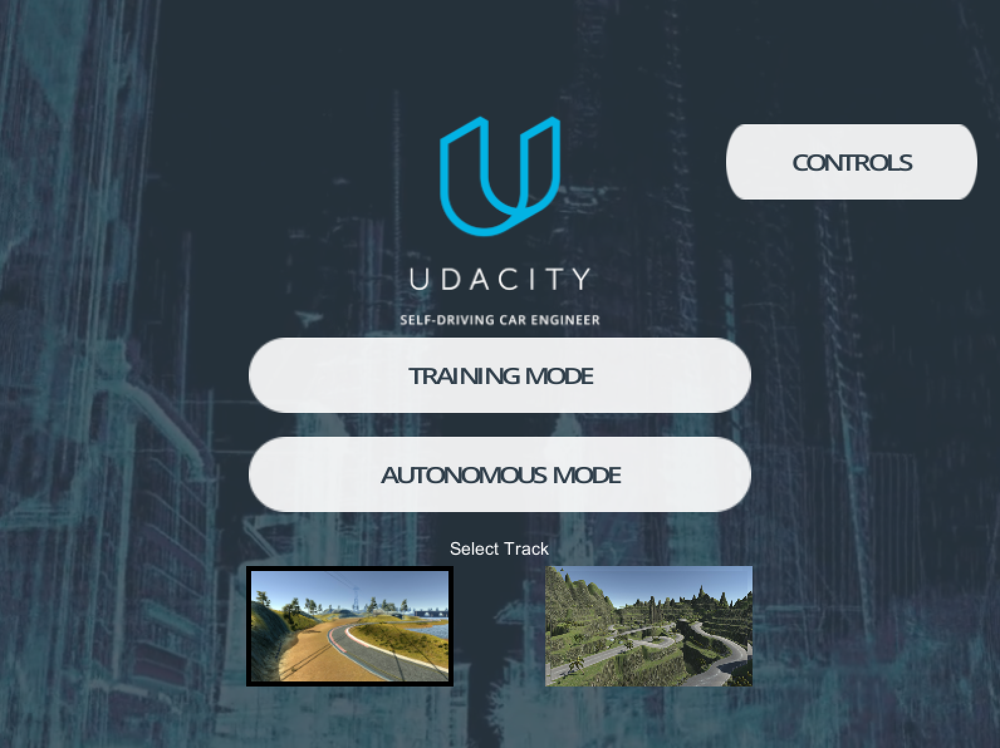
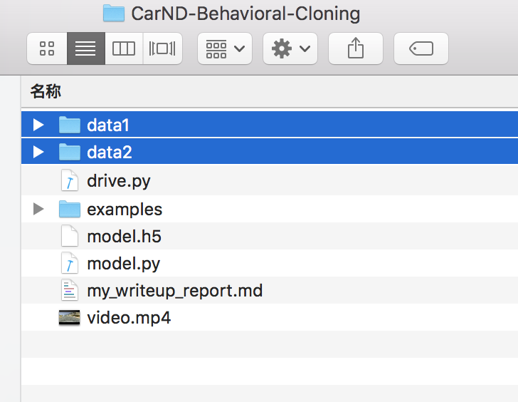
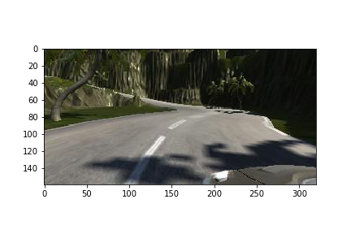
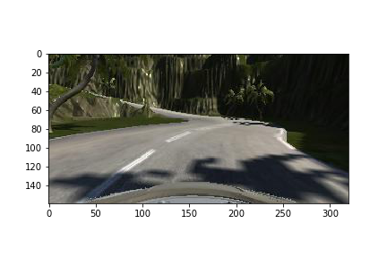
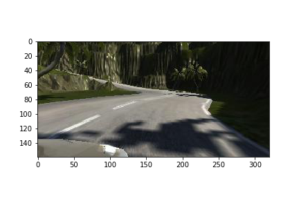
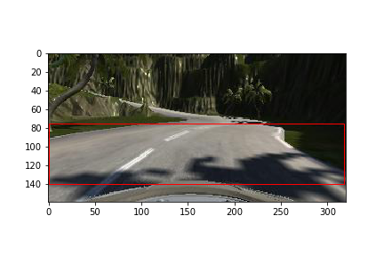
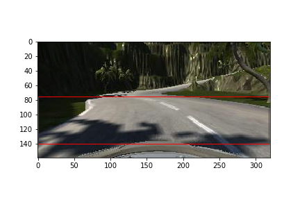

# **Behavioral Cloning** 

[//]: # (Image References)

[image1]: ./examples/Simulator_Interface.png "Simulator Main Interface"
[image2]: ./examples/random_image_center.png "Random center image"
[image3]: ./examples/random_image_left.png "Random left image"
[image4]: ./examples/random_image_right.png "Random right image"
[image5]: ./examples/mark_ROI.png 'image of ROI'
[image6]: ./examples/folder_image.png 'folder image'

## CarND Starter Kit
Install the car nanodegree starter kit if you have not already done so: [carnd starter kit](https://github.com/udacity/CarND-Term1-Starter-Kit)

## Project introduction

This project finished drive the car around the track in the simulator, collect the data and use the data train a deep learning neural network, then make the car drive autumatically.

The goals / steps of this project are the following:

* Use the simulator to collect data of good driving behavior
* Build, a convolution neural network in Keras that predicts steering angles from images
* Train and validate the model with a training and validation set
* Test that the model successfully drives around track one without leaving the road
* Summarize the results with a written report

My project includes the following files:

* model.py containing the script to create and train the model
* drive.py for driving the car in autonomous mode
* model.h5 containing a trained convolution neural network 
* writeup_report.md or writeup_report.pdf summarizing the results

## Run project
[Udacity Driving Simulator](https://github.com/udacity/self-driving-car-sim) and `drive.py` file he car can be driven autonomously around the track by executing `python drive.py model.h5 `, Here is the simulator interface.
<figure class="center">
	
</figure>


## Train the Model
### Collect train data

In order to start collecting training data, you'll need to do the following:

* Enter Training Mode in the simulator.
* Start driving the car to get a feel for the controls.
* When you are ready, hit the record button in the top right to start recording.
* Continue driving for a few laps or till you feel like you have enough data.
* Hit the record button in the top right again to stop recording.

This simulator has two sense, they are differen terrains. make sure driver the car in the center of the road as much as possible. I track data into two different folder, data1 for t Track1 and data2 for the Track2 in the simulator which make me collect the data clearly. I rename them *data1* and *data2*, Here is the folder image.
<figure class="center">
	
</figure>

### Data augmentation

The data record folder has a csv file for recording images' name, steering, throttle, break and speed, and IMG floder for recording cameras' datas(center, left and right). 
Here is an example image of center lane driving:

![alt text][image2]

In the simulator there are three cameras for center, left, right which capture images to capture driver's behavior. For convenience, the left steering and right steering add or subtract the correction factor `correction = 0.2` for the left camera and the right camera.

<figure class="center">
	
	
	
</figure>

As we can see, the 75px above and 20px below are not ROI area, and will affect the analysis of the network structure on the image. 

![alt text][image5]

 so I crop the image and left the area in the middle and a little below.
 `keras.layers.Cropping2D` function crops the image easyly,
 Here is the code `model.add(Cropping2D(cropping=((75, 20), (0,0))))`.

Before training the model, we will augment the data in case of insufficient data. so I use `cv2.flip` flip image. Here are the example，the right is fliped:
<figure class="center">
	
	
</figure>
But I don't think it's a good idea to flip all the images because of drive behaviour, so I just need to flip some photos randomly and control them by `np.random.rand() < 0.5`.
When the data is flipped, steering data need to be multiplied by -1.

### Model architecture
I use [End-to-End Deep Learning for Self-Driving Cars](https://devblogs.nvidia.com/deep-learning-self-driving-cars/) model which designed by NVIDIA. 

<figure class="center">
	
</figure>

My model architecture is shown in the following table:

|Layer                               | filter   | stride | activation |
|------------------------------------|:--------:|:------:|:----------:|
|Image Normalizaion                  |          |        |            |
|Cropping2D(cropping=(75,20),(0,0))  |          |        |            |
|Convolution                         |  5X5X24  |   2    |      relu  |
|Convolution                         |  5X5X36  |   2    |      relu  |
|Convolution                         |  5X5X48  |   2    |      relu  |
|Convolution                         |  3X3X64  |   1    |      relu  |
|Convolution                         |  3X3X48  |   1    |      relu  |
|Flatten()                           |          |        |            |
|Dropout(0.5)                        |          |        |            |
|Dense(50)                           |          |        |     relu   |
|Dense(10)                           |          |        |     relu   |
|output = Dense(1)                   |          |        |            |

## Training and Validation
Before training, I randomly assigned data and `epoch=3` to avoid overfitting. 80% of the data is used for training, and 20% for validation.

```
Epoch 1/3
87009/87009 [==============================] - 181s - loss: 0.0692 - val_loss: 0.05
Epoch 2/3
87009/87009 [==============================] - 171s - loss: 0.0521 - val_loss: 0.051
Epoch 3/3
87009/87009 [==============================] - 171s - loss: 0.0495 - val_loss: 0.049
Training Finish!
Time:  526.0187499523163
```


